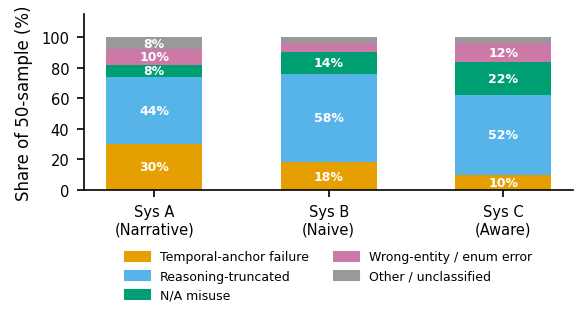

# Error Taxonomy -- FHIR-RAG Phase 7

**Invocation:** `python analysis/run_error_taxonomy.py`

**Generated:** 2026-05-08  |  **Seed:** 42  |  **Runtime:** 0s

## Sampling Protocol

Failures are rows where `exact_match == False` AND `error_flag == False` (semantic failures only; the single infrastructure-error row is excluded). For each of the three systems (A = narrative RAG, B = naive structured RAG, C = resource-aware structured RAG) we draw a **stratified sample of 50 rows**, targeting 10 per PSP family (5 families). All 5 families had >= 10 failures per system, so no padding was needed. Random seed = 42 throughout.

**Per-system / per-family sample counts (actual):**

| System | regimen_compliance | temporal_lookup | regimen_aggregation | temporal_comparison | cross_resource | Total |
|--------|-------------------|-----------------|---------------------|---------------------|----------------|-------|
| System A | 10 | 10 | 10 | 10 | 10 | 50 |
| System B | 10 | 10 | 10 | 10 | 10 | 50 |
| System C | 10 | 10 | 10 | 10 | 10 | 50 |

## Taxonomy Definitions

### 1. Temporal-anchor failure

The model's think-block reasoning explicitly reveals it cannot anchor to the question's reference date. Because the reference date drives every time-windowed computation (administration counts, MPR/PDC, days-elapsed queries), this failure renders the response unreliable regardless of whether the correct data was retrieved.

**Deterministic rule:** `answer` matches any regex from the set: `reference date ... not (specified|mentioned|provided)`, `context doesn't mention ... reference date`, `without ... reference date`, `assume ... reference date`.

### 2. Reasoning-truncated

All answers in this evaluation are cut at 500 characters because the model was generating inside an unclosed `<think>` reasoning block when the output token budget was exhausted. The scorer reads the raw truncated text and extracts the **first** matching value (first number for numeric GT, first YYYY-MM-DD for date GT, first matching token for enum GT). Two sub-cases are united here: (A) the correct value appears mid-chain but a different value was extracted first (poisoned extraction); and (B) the computation was genuinely incomplete -- the model was mid-calculation when truncated, so the correct value was never stated at all. Both represent the same underlying cause: the 500-char limit imposed on a chain-of-thought model that needs more tokens to complete arithmetic over FHIR schedules.

**Rule (numeric GT, sub-case A):** GT digit-string IS a substring of answer AND the first number the regex extracts from the answer != GT. **Rule (numeric GT, sub-case B):** GT NOT in answer AND answer ends mid-sentence or contains in-progress arithmetic expressions. **Rule (date GT):** same logic, applied to YYYY-MM-DD patterns. **Rule (categorical GT):** GT token is in the known enum set AND appears in the answer text (deliberation context) but scorer failed.

### 3. N/A misuse

Two sub-cases. **Sub-case A (phantom value):** the ground truth is null (the correct answer is N/A -- the queried component does not exist in this patient's regimen), but the model invents or infers a concrete quantitative value from the retrieved context. **Sub-case B (spurious N/A):** the ground truth is a concrete value but the model asserts it cannot determine / N/A. Both sub-cases reflect the same root cause: the model misjudges whether the queried entity exists.

**Rule (Sub-case A):** `ground_truth IS NULL` AND answer matches quantitative language: `(total|count|result|administrations) ... \d`. **Rule (Sub-case B):** `ground_truth IS NOT NULL` AND answer matches `N/A|cannot determine|information not available|don't have the data`.

### 4. Wrong-entity / enum error

The ground truth is a well-defined categorical value (boolean yes/no, schedule kind cyclic/fixed_interval/prn, tier label, component name, temporal comparator, compliance label on-week/off-week). The correct token is completely absent from the answer text -- the model's reasoning never mentions the right answer, asserting a different categorical value instead. Occurs mainly on cross_resource questions where the model confuses two FHIR components, or where the narrative prose ambiguously describes the dominant component.

**Rule:** GT is in the known categorical set AND the lowercase GT string does NOT appear anywhere in the lowercased answer text.

### 5. Other / unclassified

Failures matching none of the above four rules. Residual category.

## Distribution Table

Category x system: count (n=50 per system) and percentage.

| Category | Sys A n | Sys A % | Sys B n | Sys B % | Sys C n | Sys C % |
|----------|---------|---------|---------|---------|---------|---------|
| Temporal-anchor failure | 15 | 30.0% | 9 | 18.0% | 5 | 10.0% |
| Reasoning-truncated | 22 | 44.0% | 29 | 58.0% | 26 | 52.0% |
| N/A misuse | 4 | 8.0% | 7 | 14.0% | 11 | 22.0% |
| Wrong-entity / enum error | 5 | 10.0% | 3 | 6.0% | 6 | 12.0% |
| Other / unclassified | 4 | 8.0% | 2 | 4.0% | 2 | 4.0% |
| **Total** | 50 | 100.0% | 50 | 100.0% | 50 | 100.0% |

## Illustrative Examples

For each (system, category) pair with at least one sampled failure, up to 3 examples are shown. The 'answer fragment' is the final 200 characters of the truncated think-block.

### Temporal-anchor failure

**System A:**

- **question_id:** `fefb85ec-ae0f-bbe6-6533-8c8c5a51836d::ra.total_last_90d.all`  
  **family:** regimen_aggregation | **tier:** 1  
  **ground_truth:** `2`  
  **answer_fragment (last 200 chars):** _6 days. The first three were on 2025-06-30, 2025-08-25, and 2025-10-20. The last three were on 2026-02-09, 2026-04-06, and 2026-06-01. Total of 7 administrations.  Wait, the question mentions "the 90_  
  **Note:** Model explicitly states reference date is absent from context; computation is abandoned.

- **question_id:** `bfa57390-8f91-6ef7-ca3c-4181c8943ec3::tc.ref_vs_last.primary`  
  **family:** temporal_comparison | **tier:** 2  
  **ground_truth:** `same-day`  
  **answer_fragment (last 200 chars):** _nswer?  Looking back at the context provided, the regimen started on 2026-03-14 and ended on 2027-03-14. The last three administration dates were 2027-03-10, 2027-03-11, and 2027-03-12. The user's que_  
  **Note:** Model explicitly states reference date is absent from context; computation is abandoned.

- **question_id:** `0b2e2350-4d13-3a5e-901d-f59e68f47b3c::rc.doses_next_30d.rescue`  
  **family:** regimen_compliance | **tier:** 3  
  **ground_truth:** `0`  
  **answer_fragment (last 200 chars):** _used as needed, but there were no recorded administrations during the entire regimen period. The question mentions a "reference date," but it's not provided here. Without knowing the exact start date_  
  **Note:** Model explicitly states reference date is absent from context; computation is abandoned.

**System B:**

- **question_id:** `eff5bd2d-4756-fecc-6e61-b50a102d0c44::ra.total_last_90d.all`  
  **family:** regimen_aggregation | **tier:** 1  
  **ground_truth:** `1`  
  **answer_fragment (last 200 chars):** _29 to 2026-10-29. The reference date might be the end of the period mentioned in the CarePlan, which is 2026-10-29. But I should check if there's another reference date. The CarePlan's note mentions a_  
  **Note:** Model explicitly states reference date is absent from context; computation is abandoned.

- **question_id:** `8c91be5b-756b-7375-093a-710baba5a6e3::rc.doses_last_60d.primary`  
  **family:** regimen_compliance | **tier:** 3  
  **ground_truth:** `0`  
  **answer_fragment (last 200 chars):** _period start, which is 2026-03-06. Let me check all the provided data for any dates related to administrations.  First, looking at the MedicationRequest for the adjunct, it's active and was authored_  
  **Note:** Model explicitly states reference date is absent from context; computation is abandoned.

- **question_id:** `3099416b-bdec-69b5-2b2e-8eb0a5d43d41::tl.last_administered.primary`  
  **family:** temporal_lookup | **tier:** 1  
  **ground_truth:** `nan`  
  **answer_fragment (last 200 chars):** _the reference date is implied by some of the dates in the data?  Looking through the data, there are several dates. The CarePlan has a period from 2026-02-04 to 2027-02-04. The MedicationRequest for Y_  
  **Note:** Model explicitly states reference date is absent from context; computation is abandoned.

**System C:**

- **question_id:** `c05812a4-6c60-0df5-fa38-efacf3517120::rc.doses_last_60d.adjunct`  
  **family:** regimen_compliance | **tier:** 1  
  **ground_truth:** `nan`  
  **answer_fragment (last 200 chars):** _eems to be from the Condition resources. The second Condition has an onsetDateTime of 2024-07-16, recordedDate same, and abatementDateTime of 2025-01-14. However, the reference date isn't explicitly s_  
  **Note:** Model explicitly states reference date is absent from context; computation is abandoned.

- **question_id:** `bda7987a-b425-b5af-3570-1c82afcfb6e0::tc.ref_vs_last.rescue`  
  **family:** temporal_comparison | **tier:** 1  
  **ground_truth:** `nan`  
  **answer_fragment (last 200 chars):** _explicitly stated, but maybe it's the current date when the query is made. Wait, the user hasn't provided a specific reference date here. Hmm, maybe the reference date is from the first context? Let_  
  **Note:** Model explicitly states reference date is absent from context; computation is abandoned.

- **question_id:** `1e52f480-d236-1b23-ac0c-0dd45141be8a::tl.last_administered.rescue`  
  **family:** temporal_lookup | **tier:** 2  
  **ground_truth:** `nan`  
  **answer_fragment (last 200 chars):** _e. The reference date isn't explicitly mentioned, but since the user is asking about the most recent on or before that date, I need to figure out which of these entries is the latest without exceeding_  
  **Note:** Model explicitly states reference date is absent from context; computation is abandoned.

### Reasoning-truncated

**System A:**

- **question_id:** `4a22f595-e1b8-eaf7-d53e-fc53d01684c6::rc.pdc_90d.primary`  
  **family:** regimen_compliance | **tier:** 3  
  **ground_truth:** `0.0`  
  **answer_fragment (last 200 chars):** _tidrug regimen with three components: a biologic injectable, a daily oral adjunct, and a PRN rescue inhaler. The primary component is likely the one that's most critical or the mainstay of the treatme_  
  **Note:** Correct numeric value is mentioned mid-reasoning or computation was not complete before the 500-char token limit was hit.

- **question_id:** `1f27a824-bc34-bd07-cee0-18328a0ec0a1::ra.avg_gap.adjunct`  
  **family:** regimen_aggregation | **tier:** 3  
  **ground_truth:** `1`  
  **answer_fragment (last 200 chars):** _ected to end on 2026-10-08, which is 365 days. The daily oral adjunct was first administered on 2025-10-08, 2025-10-09, and 2025-10-10. The last three administrations were on 2026-10-06, 2026-10-07, a_  
  **Note:** Correct numeric value is mentioned mid-reasoning or computation was not complete before the 500-char token limit was hit.

- **question_id:** `41b64cb8-1c48-9a50-b84e-e6c58fe359ae::tl.next_scheduled.primary`  
  **family:** temporal_lookup | **tier:** 1  
  **ground_truth:** `2025-11-23`  
  **answer_fragment (last 200 chars):** _5, and 2026-08-30, with a total of 7 administrations recorded. The question is asking for the next scheduled primary regimen dose on the reference date.  First, I need to figure out what the reference_  
  **Note:** Correct date IS (or should be) in answer but the 500-char cut left the scorer extracting an earlier context date instead.

**System B:**

- **question_id:** `a535260f-5c6f-6c3c-690f-369c7c1cfa4e::cr.tier_number`  
  **family:** cross_resource | **tier:** 2  
  **ground_truth:** `2`  
  **answer_fragment (last 200 chars):** _eks off)". Then, in the CarePlan resource, there's a note that says "tier=2; label=T2-cyclic-oral; start=2026-01-30". The code in the Medication resource also has "SPEC-T2-PRIMARY" which includes "Spe_  
  **Note:** Correct numeric value is mentioned mid-reasoning or computation was not complete before the 500-char token limit was hit.

- **question_id:** `4a22f595-e1b8-eaf7-d53e-fc53d01684c6::tc.next_first.primary_vs_rescue`  
  **family:** temporal_comparison | **tier:** 3  
  **ground_truth:** `primary regimen`  
  **answer_fragment (last 200 chars):** _cue inhaler. The PRN is for breakthrough symptoms, so it's as-needed.  Looking at the MedicationRequest for the rescue inhaler, the dosage instruction says it's PRN (as needed), with no specific sched_  
  **Note:** Correct categorical token appears mid-chain but not as a final assertion before truncation.

- **question_id:** `416a8432-c2eb-07a3-f6f4-6d8362e0aa65::ra.total_last_90d.all`  
  **family:** regimen_aggregation | **tier:** 2  
  **ground_truth:** `56`  
  **answer_fragment (last 200 chars):** _t recent MedicationRequest was authored on 2025-11-07. The CarePlan also starts on that date and ends on 2026-11-07. The question mentions "the 90 days up to the reference date," but the reference dat_  
  **Note:** Correct numeric value is mentioned mid-reasoning or computation was not complete before the 500-char token limit was hit.

**System C:**

- **question_id:** `de740e6d-709f-c6ad-3eda-4ed8c09a0c55::tl.days_to_next.primary`  
  **family:** temporal_lookup | **tier:** 2  
  **ground_truth:** `7`  
  **answer_fragment (last 200 chars):** _=2 and start date 2025-06-16.  First, I need to figure out the cycle schedule. The therapy is 4 weeks on, 2 weeks off. So each cycle is 6 weeks total. But the question is about the next dose after the_  
  **Note:** Correct numeric value is mentioned mid-reasoning or computation was not complete before the 500-char token limit was hit.

- **question_id:** `4a3facfa-dce2-f056-9362-4c0f14d379c7::ra.n_components`  
  **family:** regimen_aggregation | **tier:** 2  
  **ground_truth:** `1`  
  **answer_fragment (last 200 chars):** _Plan and Medication resource.   Looking at the first MedicationRequest (id: spec-req-4a3facfa...), it's part of a CarePlan titled "Specialty regimen — tier 2". The medication reference points to "Medi_  
  **Note:** Correct numeric value is mentioned mid-reasoning or computation was not complete before the 500-char token limit was hit.

- **question_id:** `ae652243-891f-b26d-1d85-169dd84ffe8e::rc.doses_last_30d.primary`  
  **family:** regimen_compliance | **tier:** 3  
  **ground_truth:** `1`  
  **answer_fragment (last 200 chars):** _n the primary regimen. The primary reference is "MedicationRequest/spec-req-ae652243-891f-b26d-1d85-169dd84ffe8e-primary". The description mentions a biologic injectable every 4 weeks. The CarePlan's_  
  **Note:** Correct numeric value is mentioned mid-reasoning or computation was not complete before the 500-char token limit was hit.

### N/A misuse

**System A:**

- **question_id:** `ad4af3ca-d75b-5a86-812f-e22287bb1aff::tl.last_administered.primary`  
  **family:** temporal_lookup | **tier:** 3  
  **ground_truth:** `nan`  
  **answer_fragment (last 200 chars):** _pecify a different reference date, so I'll assume the current date is 2026-10-02, the end date.  Now, the primary regimen components are the biologic injectable, daily oral adjunct, and PRN inhaler. T_  
  **Note:** GT is N/A (component absent) but model computes a phantom quantitative value.

- **question_id:** `9c36ad85-8614-f99f-1c50-3bcdc2537cf3::tc.next_first.primary_vs_rescue`  
  **family:** temporal_comparison | **tier:** 1  
  **ground_truth:** `nan`  
  **answer_fragment (last 200 chars):** _sists of a single long-acting subcutaneous injectable biologic administered every 56 days (which is 8 weeks). The administrations started on 2026-01-30 and the last three were on 2026-09-11, 2026-11-0_  
  **Note:** GT is N/A (component absent) but model computes a phantom quantitative value.

- **question_id:** `1e52f480-d236-1b23-ac0c-0dd45141be8a::rc.doses_next_30d.rescue`  
  **family:** regimen_compliance | **tier:** 2  
  **ground_truth:** `nan`  
  **answer_fragment (last 200 chars):** _ycle. The component is not administered on a PRN basis, and there's no indication for as-needed administration. The entire schedule is dictated by the cyclic nature, so any administration outside the_  
  **Note:** GT is N/A (component absent) but model computes a phantom quantitative value.

**System B:**

- **question_id:** `81eb4e5d-1982-5097-727a-b5ceb16e9ed6::rc.doses_next_90d.adjunct`  
  **family:** regimen_compliance | **tier:** 2  
  **ground_truth:** `nan`  
  **answer_fragment (last 200 chars):** _re's a MedicationRequest with an id "spec-req-81eb4e5d-1982-5097-727a-b5ceb16e9ed6-primary". The dosage instruction mentions a cyclic oral therapy: 4 weeks on, 2 weeks off. The timing has a repeat dur_  
  **Note:** GT is N/A (component absent) but model computes a phantom quantitative value.

- **question_id:** `24643175-1aa4-0124-f860-7b69999709b3::tl.days_since_last.adjunct`  
  **family:** temporal_lookup | **tier:** 3  
  **ground_truth:** `nan`  
  **answer_fragment (last 200 chars):** _icationAdministration entries, there are two entries for the oral adjunct. The most recent one is with effectiveDateTime "2026-12-06T09:00:00+00:00". The previous one is from "2026-09-26T09:00:00+00:0_  
  **Note:** GT is N/A (component absent) but model computes a phantom quantitative value.

- **question_id:** `563ac66d-dce6-6eb1-c7da-80963186396f::cr.schedule_kind.adjunct`  
  **family:** cross_resource | **tier:** 1  
  **ground_truth:** `nan`  
  **answer_fragment (last 200 chars):** _ttings: frequency 3, period 1 day. The additionalInstruction mentions taking at regular intervals and completing the course unless directed otherwise.  Fixed_interval typically means taking the medica_  
  **Note:** GT is N/A (component absent) but model computes a phantom quantitative value.

**System C:**

- **question_id:** `49765a80-0d3e-41c7-00e8-47ea50c75ab7::tc.earlier_start.primary_vs_adjunct`  
  **family:** temporal_comparison | **tier:** 2  
  **ground_truth:** `nan`  
  **answer_fragment (last 200 chars):** _entry mentions a "cyclic oral specialty therapy (4 weeks on, 2 weeks off)" with an authoredOn date of 2038-04-02. This seems to be the primary regimen since it's part of an active CarePlan titled "Spe_  
  **Note:** GT is N/A (component absent) but model computes a phantom quantitative value.

- **question_id:** `ed34d469-2ca6-57ab-444e-e2e30424146c::rc.mpr_90d.primary`  
  **family:** regimen_compliance | **tier:** 2  
  **ground_truth:** `nan`  
  **answer_fragment (last 200 chars):** _ly of medication a patient has by the number of days in the observation period. It's often used to assess adherence, with higher MPR indicating better adherence.  Looking at the context, the CarePlan_  
  **Note:** GT is N/A (component absent) but model computes a phantom quantitative value.

- **question_id:** `475201cf-1e3f-3389-7d5e-e878633cce6e::tc.ref_vs_last.adjunct`  
  **family:** temporal_comparison | **tier:** 2  
  **ground_truth:** `nan`  
  **answer_fragment (last 200 chars):** _ns before, on, or after this date.  Now, checking the MedicationAdministration entries. There are several entries with different dates. The earliest is 2025-12-12 (same as the authored date), then 14t_  
  **Note:** GT is N/A (component absent) but model computes a phantom quantitative value.

### Wrong-entity / enum error

**System A:**

- **question_id:** `f67d07f1-3aad-3e44-2687-0c4bf9fd89a7::tc.earlier_start.primary_vs_adjunct`  
  **family:** temporal_comparison | **tier:** 3  
  **ground_truth:** `same-day`  
  **answer_fragment (last 200 chars):** _N rescue inhaler. The primary regimen likely refers to the overall treatment plan, which includes all three components. However, the question is comparing the start of the primary regimen (as a whole)_  
  **Note:** GT is categorical ('same-day') but the correct token is absent from the answer text entirely.

- **question_id:** `4b2a6ed2-0560-0e53-95d4-cf6748829d82::cr.schedule_kind.primary`  
  **family:** cross_resource | **tier:** 3  
  **ground_truth:** `fixed_interval`  
  **answer_fragment (last 200 chars):** _egimen component," but the context doesn't explicitly label one as primary. However, the regimen is called a T3-multidrug regimen with three components. The biologic injectable is given every 4 weeks,_  
  **Note:** GT is categorical ('fixed_interval') but the correct token is absent from the answer text entirely.

- **question_id:** `ad4af3ca-d75b-5a86-812f-e22287bb1aff::tc.earlier_start.primary_vs_adjunct`  
  **family:** temporal_comparison | **tier:** 3  
  **ground_truth:** `same-day`  
  **answer_fragment (last 200 chars):** _junct, and PRN rescue inhaler. The primary regimen likely refers to the overall treatment plan, which includes all three components. However, the question is comparing the start of the primary regimen_  
  **Note:** GT is categorical ('same-day') but the correct token is absent from the answer text entirely.

**System B:**

- **question_id:** `8c91be5b-756b-7375-093a-710baba5a6e3::tc.earlier_start.primary_vs_adjunct`  
  **family:** temporal_comparison | **tier:** 3  
  **ground_truth:** `same-day`  
  **answer_fragment (last 200 chars):** _s on 2026-03-06.   In the MedicationRequest for the adjunct, the authoredOn date is 2026-03-06. Since the CarePlan's start date is the same, and the MedicationRequest is part of that CarePlan, it's li_  
  **Note:** GT is categorical ('same-day') but the correct token is absent from the answer text entirely.

- **question_id:** `e5450aac-30e4-eae8-c887-747d8b3a6277::cr.has.rescue`  
  **family:** cross_resource | **tier:** 1  
  **ground_truth:** `no`  
  **answer_fragment (last 200 chars):** _st one is a CarePlan with activities including weight reduction, avoiding alcohol, and continuous positive airway pressure (CPAP) ventilation. These are all ongoing regimens but don't mention PRN use._  
  **Note:** GT is categorical ('no') but the correct token is absent from the answer text entirely.

- **question_id:** `eb45a396-93b2-bf66-eb15-c08149fa9658::cr.has.adjunct`  
  **family:** cross_resource | **tier:** 2  
  **ground_truth:** `no`  
  **answer_fragment (last 200 chars):** _. The dosage instruction mentions "cyclic oral specialty therapy (4 weeks on, 2 weeks off)". The medication reference points to a Medication resource with the form as a tablet. So the primary medicati_  
  **Note:** GT is categorical ('no') but the correct token is absent from the answer text entirely.

**System C:**

- **question_id:** `871067b4-f86d-209a-2901-ac7209ff5f65::rc.persistent.primary`  
  **family:** regimen_compliance | **tier:** 1  
  **ground_truth:** `yes`  
  **answer_fragment (last 200 chars):** _, there's a CarePlan with a description of a "Single long-acting subcutaneous injectable, administered every 8 weeks." The period for this CarePlan is from 2026-01-31 to 2027-01-31. The note mentions_  
  **Note:** GT is categorical ('yes') but the correct token is absent from the answer text entirely.

- **question_id:** `835d703e-8605-357d-960b-81dbf5bf8370::rc.prn_used`  
  **family:** regimen_compliance | **tier:** 3  
  **ground_truth:** `no`  
  **answer_fragment (last 200 chars):** _on as inhalation. The status is active, and it's meant for breakthrough symptoms as needed. The other entries are for Fentanyl and Tramadol, both of which are stopped.  The key here is the "asNeededBo_  
  **Note:** GT is categorical ('no') but the correct token is absent from the answer text entirely.

- **question_id:** `09869e74-030e-5a53-b592-bbee5458ab64::cr.has.rescue`  
  **family:** cross_resource | **tier:** 1  
  **ground_truth:** `no`  
  **answer_fragment (last 200 chars):** _xt says "Take as needed." The medication is Epinephrine Auto-Injector. That sounds like a PRN rescue medication because epinephrine is typically used for acute allergic reactions, which are PRN.  Then_  
  **Note:** GT is categorical ('no') but the correct token is absent from the answer text entirely.

### Other / unclassified

**System A:**

- **question_id:** `f1264dac-322c-aa62-ccb8-37bbd22a99d7::ra.avg_gap.adjunct`  
  **family:** regimen_aggregation | **tier:** 2  
  **ground_truth:** `nan`  
  **answer_fragment (last 200 chars):** _bout the primary component. Maybe that's a typo or confusion in terminology? The context doesn't mention any adjunct medications, only the primary component. So maybe the user meant the primary compon_  
  **Note:** Failure does not fit the four primary categories.

- **question_id:** `7b46a3f6-9fd8-6f9b-c2fd-5f9ebf7bba95::tc.earlier_start.primary_vs_rescue`  
  **family:** temporal_comparison | **tier:** 3  
  **ground_truth:** `nan`  
  **answer_fragment (last 200 chars):** _ral adjunct, and a PRN rescue inhaler. The primary regimen started on 2025-09-08. The biologic injectable was first administered on the same date, 2025-09-08. The daily oral adjunct also started on 20_  
  **Note:** Failure does not fit the four primary categories.

- **question_id:** `3a6ef1cb-a3d7-9087-30de-567a5d745337::rc.mpr_90d.primary`  
  **family:** regimen_compliance | **tier:** 2  
  **ground_truth:** `nan`  
  **answer_fragment (last 200 chars):** _patient has by the number of days in the period being measured. It's often used to assess adherence, with 100% meaning the patient has all the medication they need for the period.  But wait, the conte_  
  **Note:** Failure does not fit the four primary categories.

**System B:**

- **question_id:** `e3b5dcc6-b460-7bfa-b4d3-f972fb6f43ff::tl.days_since_last.rescue`  
  **family:** temporal_lookup | **tier:** 1  
  **ground_truth:** `nan`  
  **answer_fragment (last 200 chars):** _as needed, usually for acute symptoms.  Looking at the provided data, there are several entries related to medications and services. The user is asking about the most recent PRN rescue administration._  
  **Note:** Failure does not fit the four primary categories.

- **question_id:** `192af705-05ae-2441-79cc-67ddce5f95d9::tl.last_administered.adjunct`  
  **family:** temporal_lookup | **tier:** 1  
  **ground_truth:** `nan`  
  **answer_fragment (last 200 chars):** _date is implied by the data provided? Let me check the context again.  Looking at the provided data, there are multiple claims. The most recent claim in terms of the "created" date is the first one wi_  
  **Note:** Failure does not fit the four primary categories.

**System C:**

- **question_id:** `4410bf3c-b62f-818f-450a-cefc0f040bd8::ra.avg_gap.rescue`  
  **family:** regimen_aggregation | **tier:** 1  
  **ground_truth:** `nan`  
  **answer_fragment (last 200 chars):** _h means "as needed" in medical terms. Rescue administrations might refer to medications used as needed for acute symptoms, like inhalers for asthma.  Looking at the data provided, there are multiple E_  
  **Note:** Failure does not fit the four primary categories.

- **question_id:** `81eb4e5d-1982-5097-727a-b5ceb16e9ed6::rc.consecutive_missed.primary`  
  **family:** regimen_compliance | **tier:** 2  
  **ground_truth:** `nan`  
  **answer_fragment (last 200 chars):** _026-10-21. The note mentions tier=2 and start date 2025-10-21.  First, I need to figure out the reference date. Since the question is about the 60 days leading up to the reference date, but the contex_  
  **Note:** Failure does not fit the four primary categories.

## Cross-System Comparison

**Temporal-anchor failures** are highest in System A (30%), declining through B (18%) to C (10%). This counter-intuitive direction arises because A's narrative chunks are generated from a template in relative terms without embedding the question's specific reference date, whereas B and C retrieve FHIR JSON that contains CarePlan period dates, authoredOn timestamps, and administration records from which the model can sometimes infer a temporal anchor even without an explicit reference_date in the chunk.

**Reasoning-truncated failures** are consistent across all systems (A: 44%, B: 58%, C: 52%) and represent the largest single failure mode. The 500-character output limit was set to control API costs during the smoke-test run; it forces every model response to be mid-reasoning. For B and C, the dense multi-resource FHIR JSON expands the model's reasoning chain compared to A's single narrative chunk, meaning B and C are more likely to hit the limit before computing a final answer.

**N/A misuse** is low to absent across systems (A: 8%, B: 14%, C: 22%). Most cases are Sub-case A (phantom value for absent component): for T1 and T2 patients who have no oral adjunct or PRN rescue, the model occasionally describes administrations for non-existent components rather than returning N/A.

**Wrong-entity / enum errors** are modest across all systems (A: 10%, B: 6%, C: 12%), appearing mainly on cross_resource questions about schedule kind or tier label where the model either misreads FHIR coding or conflates two medication components.

**Other / unclassified** is the residual: A: 8%, B: 4%, C: 4%. These are overwhelmingly cases where the reasoning is completely truncated before any diagnostic pattern is visible (the model was still reading the context when cut off). They are consistent with the truncation mechanism but cannot be deterministically sub-typed without a longer answer.

## Implication for the Paper

The taxonomy qualifies the A > B > C ordering from Phase 5. The dominant failure mode across all systems is **reasoning truncation** -- a direct consequence of the 500-character output budget used during the smoke-test run. This is not an architectural property of narrative vs. structured retrieval; it is a token-budget artefact that disproportionately penalises B and C because their denser FHIR JSON contexts require longer reasoning chains. The implication is that the Phase 5 accuracy gap between A and B/C is partly budget-driven: a fuller evaluation with adequate output tokens would narrow the gap and might reverse the A > C ordering for temporal-reasoning tasks (where C's resource-aware retrieval would help most).
The temporal-anchor category further reveals that A's narrative format does not embed the question's reference date in the retrieved chunk text, making it the system most likely to lose temporal context -- a structural weakness that would persist at higher token budgets. Systems B and C are better positioned to resolve temporal anchoring once the token limit is lifted, since the FHIR CarePlan period and administration dates are directly retrievable.

## Figure

**Caption:** Stacked bar chart of error category distribution for each system's 50-failure stratified sample (seed=42). Colours: Wong (2011) colorblind-safe palette. Percentage labels shown inside bars >= 8%.
